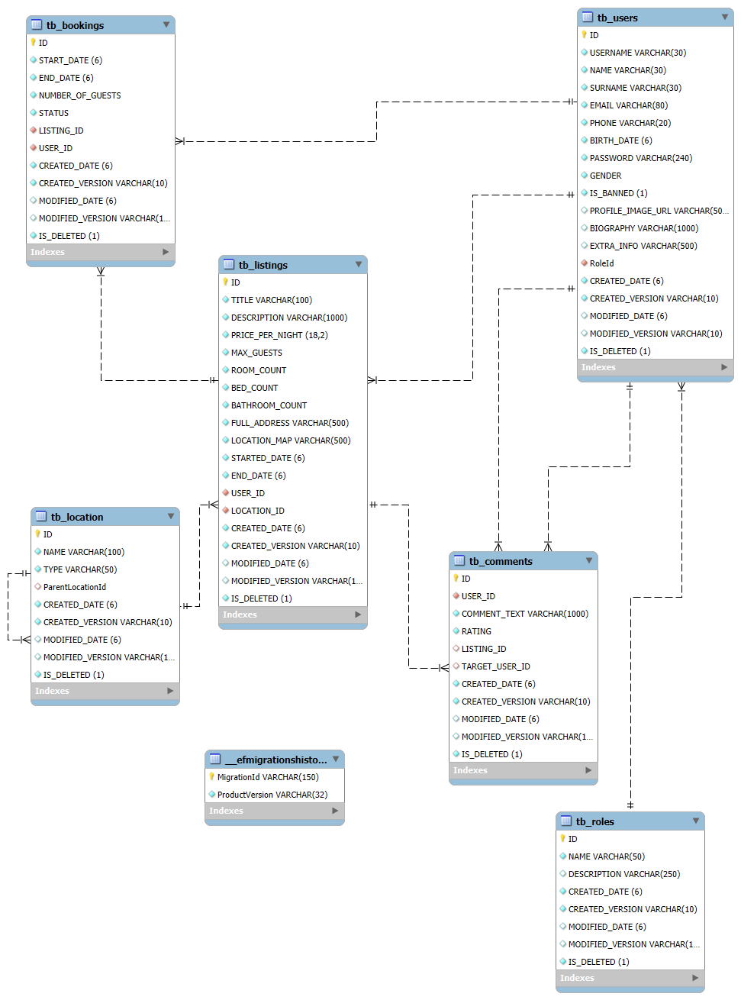

"# AliAlpKUREL-16070006047_airbnbMidterm" 
# Airbnb Minimal Projesi
#### develoeper - Ali Alp Kurel

### ER Diagram

### Projede kullanılan teknolojiler
- Dotnet 8 Web Api 
- Swagger/OpenAPI
- Entity Framework
- Mysql
- Rest 
- Diğer -> Markdown, json, git

### Modeller
- **Booking** - Rezervasyon
- **Comment** - Yorumlar
- **Listing** - İlanlar
- **Location** - Adres(ülke, il, ilçe, mahalle)
- **Role** - kullanıcı rolleri
- **User** - kullanıcılar

### Api Belgeleri

#### Kimlik Doğrulama

- **POST /api/v1/Authentications/register** [Anonymous] - Yeni kullanıcı kaydı yapar ve JWT token döner.
- **POST /api/v1/Authentications/Login** [Admin,Guest,Host] - Giriş yapar ve JWT token döner.

#### Rezervasyonlar

- **POST /api/v1/Bookings/AddBooking** [Guest] - Rezervasyon ekler.
- **PUT /api/v1/Bookings/ApproveBooking** [Host] - Rezervasyonu onaylar.
- **GET /api/v1/Bookings/GetAllBookings** [Admin]- Tüm rezervasyonları getirir.

#### Yorumlar

- **POST /api/v1/Comments/AddComment** [Host, Guest] - Bir ilan veya kullanıcı için yorum ekler.
- **GET /api/v1/Comments/GetComments** [Admin] - İlan veya kullanıcı için yorumları getirir.
- **DELETE /api/v1/Comments/DeleteComment** [Host, Guest] - Yorum siler.
- **PUT /api/v1/Comments/UpdateComment** [Host, Guest] - Yorum günceller.

#### İlanlar

- **POST /api/v1/Listings/AddListing** [Host] - Yeni ilan ekler.
- **GET /api/v1/Listings/GetAllListings** [*] - Tüm Filtreleyerek ve paginatörle ilanları getirir.
- **GET /api/v1/Listings/GetListingById** [*] - Bir ilanı ID ile getirir.
- **PUT /api/v1/Listings/UpdateListing** [Host] - İlanı günceller.
- **DELETE /api/v1/Listings/DeleteListing** [Host] - İlanı siler.

#### Lokasyonlar

- **POST /api/v1/Locations/AddLocation** [Admin] - Yeni bir lokasyon ekler.
- **GET /api/v1/Locations/GetAllLocations** [*]- Tüm lokasyonları getirir.

#### Kullanıcılar

- **GET /api/v1/Users/GetAllUsers** [Admin] - Tüm kullanıcıları getirir.
- **GET /api/v1/Users/GetUserById** [Host, Guest, Admin] - Bir kullanıcıyı ID ile getirir.
- **PUT /api/v1/Users/UpdateUser** [Guest, Host] - Kullanıcıyı günceller.
- **DELETE /api/v1/Users/DeleteUser** [Admin]- Kullanıcıyı siler.
- **PUT /api/v1/Users/ChangePassword** [Host, User] - Kullanıcı şifresini değiştirir.
- 
- **PUT /api/v1/Users/BanUser** [Admin] - Belirtilen kullanıcıyı banlar.
- **PUT /api/v1/Users/UnbanUser** [Admin] - Belirtilen kullanıcının banını kaldırır.
- **GET /api/v1/Users/GetUserStats** [Admin] - Kullanıcı rolleri bazında istatistikler döndürür
- **GET /api/v1/Users/GetBookingStats** [Admin] - rezervasyon istatistiklerini döndürür.
- **GET /api/v1/Users/TopRatedListings** [Admin] - En yüksek puanlı ilanları listeler

